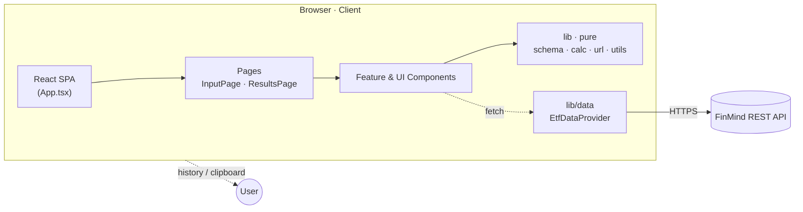
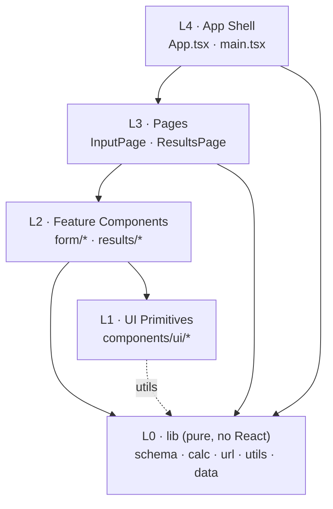
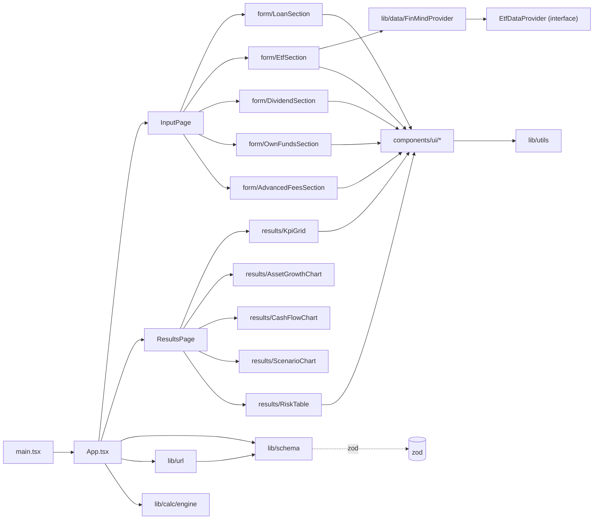
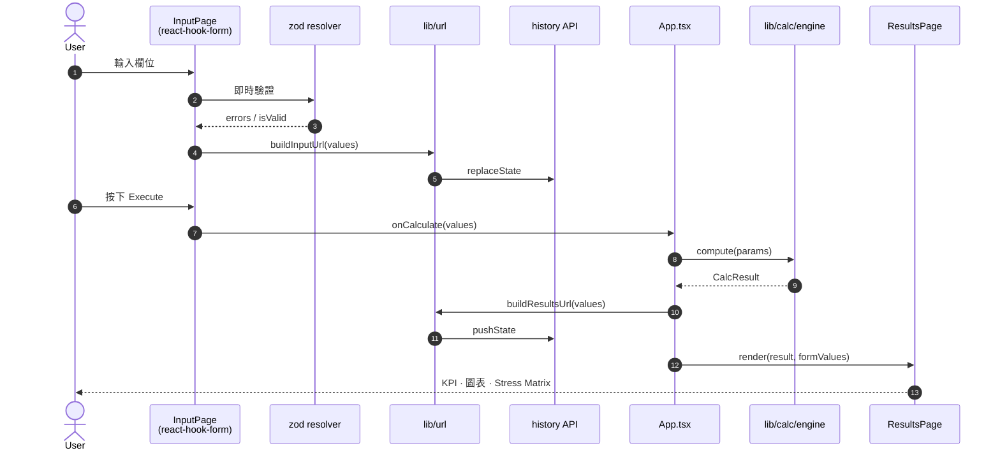
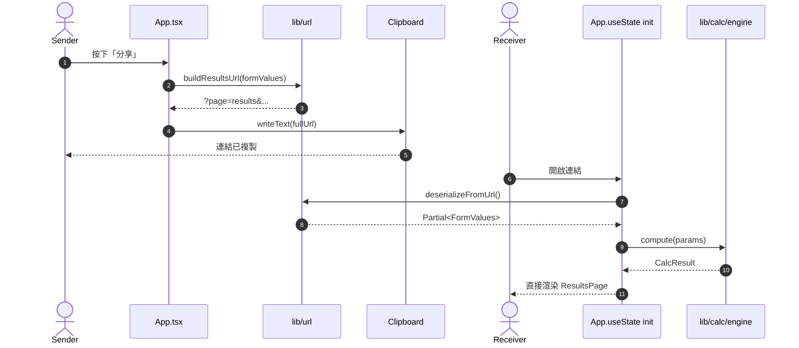
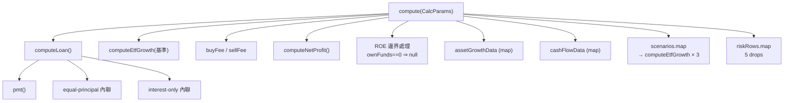
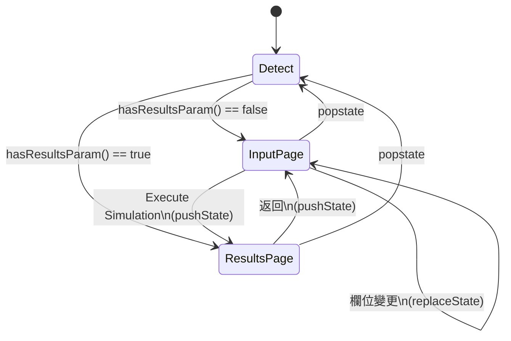

# 借來的光 · 架構文件 (Architecture)

> 配套文件：[`PRD.md`](./PRD.md)
> 範圍：MVP（單頁前端 · 無後端 · 無資料庫）

---

## 0. 目錄

1. 系統總覽
2. 技術棧
3. 模組分層
4. 目錄結構
5. 模組依賴圖
6. 資料流
7. 狀態管理
8. 路由與 URL 序列化
9. 計算引擎結構
10. UI Composition
11. 外部資料邊界 (FinMind)
12. 建置與部署
13. 效能策略
14. 擴充指南
15. Mermaid Diagrams（GitHub 渲染版）

---

## 1. 系統總覽

```
        ┌────────────────────────────────────────────┐
        │                Browser (Client)            │
        │  ┌──────────────────────────────────────┐  │
        │  │           React App (SPA)            │  │
        │  │  ┌─────────────┐   ┌──────────────┐  │  │
        │  │  │  Pages      │ → │ Components   │  │  │
        │  │  └─────────────┘   └──────────────┘  │  │
        │  │           ↓               ↓          │  │
        │  │  ┌──────────────────────────────┐    │  │
        │  │  │  lib/  schema · calc · url   │    │  │
        │  │  └──────────────────────────────┘    │  │
        │  │           ↓                          │  │
        │  │  ┌──────────────────────────────┐    │  │
        │  │  │ lib/data  (EtfDataProvider)  │ ──→│  │ ──┐
        │  │  └──────────────────────────────┘    │  │   │
        │  └──────────────────────────────────────┘  │   │
        │  URL state · history.pushState · clipboard │   │
        └────────────────────────────────────────────┘   │
                                                         ▼
                                          ┌──────────────────────┐
                                          │  FinMind REST API    │
                                          │  (CORS, public)      │
                                          └──────────────────────┘
```

**特性**

- 純前端 SPA · 所有計算在瀏覽器即時完成
- 無後端、無資料庫、無使用者帳號
- 第三方依賴只有 FinMind（且為使用者主動觸發）
- 狀態以 URL 為單一真實來源 (Single Source of Truth)

---

## 2. 技術棧

| 類別 | 技術 | 版本範圍 | 用途 |
| --- | --- | --- | --- |
| 建置 | Vite | 8.x | Dev server + build |
| 框架 | React | 19.x | UI |
| 語言 | TypeScript | 6.x | 型別檢查 |
| 樣式 | Tailwind CSS | 4.x | utility-first CSS |
| 元件層 | Radix UI Primitives | latest | 無樣式可及性元件 |
| 表單 | react-hook-form + zod + @hookform/resolvers | latest | 表單狀態 + 驗證 |
| 圖表 | Recharts | 3.x | KPI、折線、長條 |
| 圖示 | lucide-react | 1.x | SVG 圖示 |
| 測試 | Vitest + jsdom + @testing-library/react | 4.x | 單元測試 |
| Lint | ESLint + typescript-eslint | latest | 程式碼風格 |

---

## 3. 模組分層

```
┌────────────────────────────────────────────────┐
│  L4 · App Shell                                │
│      App.tsx · main.tsx · index.html           │
├────────────────────────────────────────────────┤
│  L3 · Pages（路由節點）                         │
│      pages/InputPage.tsx                       │
│      pages/ResultsPage.tsx                     │
├────────────────────────────────────────────────┤
│  L2 · Feature Components                       │
│      components/form/*                         │
│      components/results/*                      │
├────────────────────────────────────────────────┤
│  L1 · UI Primitives（樣式 + Radix 包裝）        │
│      components/ui/*                           │
├────────────────────────────────────────────────┤
│  L0 · lib（純函式 / 無 React）                  │
│      lib/calc/  · lib/schema  · lib/url        │
│      lib/utils  · lib/data/                    │
└────────────────────────────────────────────────┘
```

**依賴方向：上層可引用下層，下層禁止反向引用**。
`lib/` 不可 import 任何 React 或元件，便於單元測試。

---

## 4. 目錄結構

```
Borrowed-Light/
├─ docs/
│  ├─ PRD.md
│  └─ ARCHITECTURE.md          ← 本檔
├─ public/
├─ src/
│  ├─ App.tsx                  路由分派 (input / results)
│  ├─ main.tsx                 入口
│  ├─ index.css                Tailwind v4 + 設計系統
│  │
│  ├─ pages/
│  │  ├─ InputPage.tsx
│  │  └─ ResultsPage.tsx
│  │
│  ├─ components/
│  │  ├─ form/
│  │  │  ├─ LoanSection.tsx
│  │  │  ├─ EtfSection.tsx
│  │  │  ├─ DividendSection.tsx
│  │  │  ├─ OwnFundsSection.tsx
│  │  │  ├─ AdvancedFeesSection.tsx
│  │  │  └─ FormField.tsx
│  │  ├─ results/
│  │  │  ├─ KpiGrid.tsx
│  │  │  ├─ AssetGrowthChart.tsx
│  │  │  ├─ CashFlowChart.tsx
│  │  │  ├─ ScenarioChart.tsx
│  │  │  └─ RiskTable.tsx
│  │  └─ ui/
│  │     ├─ card.tsx · button.tsx · input.tsx
│  │     ├─ select.tsx · label.tsx · badge.tsx
│  │     └─ collapsible.tsx
│  │
│  └─ lib/
│     ├─ schema.ts             Zod 表單 schema + DEFAULT_VALUES
│     ├─ url.ts                URL ↔ FormValues 序列化
│     ├─ utils.ts              cn / formatCurrency / formatPercent
│     ├─ calc/
│     │  ├─ engine.ts          純函式計算引擎
│     │  └─ engine.test.ts
│     └─ data/
│        ├─ EtfDataProvider.ts  介面
│        └─ FinMindProvider.ts  實作
│
├─ index.html
├─ vite.config.ts
├─ tsconfig*.json
└─ package.json
```

---

## 5. 模組依賴圖

> 箭頭：A → B 表示 A import B。
> 為避免迴圈，依賴只能由上往下穿層。

```
                       main.tsx
                          │
                          ▼
                       App.tsx ─────────────────┐
                          │                     │
              ┌───────────┴────────────┐        │
              ▼                        ▼        │
       InputPage.tsx              ResultsPage.tsx
              │                        │
   ┌──────────┴──────────┐    ┌────────┴─────────┐
   ▼                     ▼    ▼                  ▼
 form/LoanSection ... form/AdvancedFees   results/KpiGrid ... results/RiskTable
   │                              │              │
   ▼                              ▼              ▼
 ui/card, input, select,  ui/collapsible    ui/card, badge
 button, label                                ↑
   │                                          │
   ▼                                          │
 lib/utils.ts (cn)                            │
                                              │
        ┌───────── lib/schema.ts ──────────┐  │
        │              │                   │  │
        ▼              ▼                   ▼  ▼
 zod              lib/url.ts        lib/calc/engine.ts
                                          │
                                          ▼
                                   (純函式 · 無依賴)

 InputPage / form/EtfSection ──→ lib/data/FinMindProvider
                                          │
                                          ▼
                                  EtfDataProvider (介面)
                                          │
                                          ▼
                                  window.fetch · AbortController
```

**規則**

- `lib/calc/engine.ts` 為**純函式**且零依賴（不引 zod、不引 React、不讀 DOM）→ 易測試
- `lib/schema.ts` 只依賴 `zod`
- `lib/url.ts` 只依賴 `lib/schema.ts`（拿 `DEFAULT_VALUES` 與 `FormValues` 型別）
- `lib/data/*` 只依賴瀏覽器 fetch API；經 `EtfDataProvider` 介面對外
- UI 元件可引用 `lib/utils`，但不應引用 `lib/calc`（透過 props 接資料）

---

## 6. 資料流

### 6.1 輸入 → 結果

```
 [User keystroke]
       │
       ▼
 react-hook-form (內部 state)
       │
       ├──→ zodResolver (即時驗證)
       │
       ▼
 watch() → FormValues
       │
       ├──→ buildInputUrl(values)  →  history.replaceState
       │                              （不污染歷史）
       │
       ▼  [User clicks Execute]
 formValuesToCalcParams(values)        ← App.tsx
       │
       ▼
 compute(params)                       ← lib/calc/engine.ts
       │
       ▼
 CalcResult  ───→  setState
       │
       ├──→ buildResultsUrl(values) → history.pushState
       │
       ▼
 <ResultsPage result formValues onBack />
       │
       ├──→ KpiGrid({ result })
       ├──→ AssetGrowthChart({ data: result.assetGrowthData })
       ├──→ CashFlowChart({ data: result.cashFlowData })
       ├──→ ScenarioChart({ scenarios: result.scenarios })
       └──→ RiskTable({ rows: result.riskRows })
```

### 6.2 結果 → 分享

```
 [User clicks 分享]
       │
       ▼
 buildResultsUrl(formValues)
       │
       ▼
 navigator.clipboard.writeText(url)
       │
       ▼
 alert("連結已複製")
   (fallback: prompt() 顯示文字)
```

### 6.3 還原（從分享連結進入）

```
 location.search 包含 page=results
       │
       ▼
 App.tsx · useState 初始化:
   formValues = { ...DEFAULT_VALUES, ...deserializeFromUrl() }
   result = hasResultsParam() ? compute(...) : null
       │
       ▼
 立即進入 ResultsPage
```

### 6.4 popstate

```
 [使用者按瀏覽器上一頁 / 下一頁]
       │
       ▼
 popstate event ─→ syncFromUrl()
                       │
                       ▼
                 重新讀取 URL，重設 formValues / result / page
```

---

## 7. 狀態管理

### 7.1 狀態種類

| 狀態 | 儲存位置 | 生命週期 | 範例 |
| --- | --- | --- | --- |
| 路由 (input/results) | `App.tsx` useState + URL `page` | session | 哪一頁 |
| 表單值 | `react-hook-form` + URL params | session | 14 個欄位 |
| 計算結果 | `App.tsx` useState | session | `CalcResult` |
| 表單 UI（折疊狀態） | 個別元件 useState | session | AdvancedFeesSection.open |
| FinMind 載入狀態 | `EtfSection` useState | section | loading / fetchError |

### 7.2 為什麼不用全域狀態管理

- 狀態形狀小、層級淺，prop drilling 仍可控
- URL 已是真實來源，重複建立 Zustand / Redux store 是過度設計
- 計算引擎為純函式，重新跑成本極低（< 50ms）

---

## 8. 路由與 URL 序列化

### 8.1 路由策略

- 採 **query-string-based pseudo routing**（非 React Router）
- 透過 `URLSearchParams` 的 `page=input|results` 切換頁面
- 好處：可分享、零路由 dependency、易於 popstate 整合

### 8.2 序列化

| 完整鍵 | 短鍵 | 範例 |
| --- | --- | --- |
| `loanAmount` | `la` | `la=1000000` |
| `annualLoanRatePct` | `lr` | `lr=3.5` |
| `termYears` | `ty` | `ty=7` |
| `repaymentMethod` | `rm` | `rm=amortized` |
| `etfSymbol` | `es` | `es=0050` |
| `annualGrowthRatePct` | `gr` | `gr=8` |
| `dividendYieldPct` | `dy` | `dy=3` |
| `dividendPolicy` | `dp` | `dp=none` |
| `customReinvestRatioPct` | `cr` | `cr=50` |
| `ownFunds` | `of` | `of=300000` |
| `dividendTaxRatePct` | `dt` | `dt=28` |
| `tradingTaxRatePct` | `tt` | `tt=0.1` |
| `brokerageRatePct` | `br` | `br=0.1425` |
| `brokerageDiscountPct` | `bd` | `bd=60` |

完整範例：

```
?page=results&la=1000000&lr=3.5&ty=7&rm=amortized&gr=8&dy=3&dp=none&of=300000
```

### 8.3 反序列化策略

- 數值欄位以 `parseFloat` 解析；NaN 時忽略
- 字串欄位（enum）直接設值，型別由 zod 在後續使用時把關
- 缺漏的鍵以 `DEFAULT_VALUES` 補齊

---

## 9. 計算引擎結構

### 9.1 函式拓撲

```
compute(CalcParams)
   ├─ computeLoan({ ... })
   │     ├─ pmt(P, annualRate, n)          // 本息均攤
   │     ├─ (equal-principal 內聯)
   │     └─ (interest-only  內聯)
   │
   ├─ computeEtfGrowth({ ... })            // 基準情境
   │
   ├─ buyFee, sellFee 計算
   ├─ computeNetProfit(...)
   ├─ netReturn / roe (含邊界處理)
   │
   ├─ assetGrowthData  (mapping)
   ├─ cashFlowData     (mapping)
   ├─ scenarios.map(s ⇒ computeEtfGrowth + computeNetProfit)
   └─ riskRows.map(drop ⇒ 線性計算)
```

### 9.2 不變量 (Invariants)

- `compute()` 為 pure：同樣 input 永遠回相同 output
- 不讀寫 DOM、不發 fetch、不存 localStorage
- 邊界皆於函式內處理（`r = 0`, `n = 0`, `ownFunds = 0`...）

### 9.3 測試切面

| 測試對象 | 重點 |
| --- | --- |
| `pmt` | 與 Excel `PMT` 函數誤差 < 0.1% |
| `computeLoan` | 三種還款方式總利息正確、年末餘額為 0 |
| `computeEtfGrowth` | 再投入 0% / 100% 對最終市值的差異 |
| `compute` | scenario / risk row 數量、`isInsolvable` 旗標、`roe === null` 條件 |

---

## 10. UI Composition

### 10.1 元件抽象層次

| 層 | 範例 | 職責 |
| --- | --- | --- |
| Primitive | `Card`、`Button`、`Input`、`Select` | 風格 + 可及性，**不**懂業務 |
| Field | `FormField` | label + suffix + error，**不**懂 schema |
| Section | `LoanSection`、`EtfSection`... | 接 `UseFormReturn<FormValues>`，渲染欄位 + 觸發 setValue |
| Page | `InputPage`、`ResultsPage` | 組裝 Section、處理路由邊界 |

### 10.2 設計系統錨點

- 設計 tokens 集中在 `index.css` 的 `@theme` block
- 自訂工具類：`text-glow-purple`、`text-glow-cyan`、`cyber-panel`、`cyber-panel-glow`、`neon-ring`、`mono-tabular`、`pulse-dot`
- Recharts 顏色為硬編碼字串（與 token 同步維護，未抽 ESM 常數）

---

## 11. 外部資料邊界（FinMind）

### 11.1 介面 (`EtfDataProvider`)

```ts
interface EtfInfo {
  symbol: string
  name?: string
  latestPrice?: number
  annualGrowthRateEstimate?: number   // decimal
  dividendYieldEstimate?: number      // decimal
}

interface EtfDataProvider {
  fetchEtfInfo(symbol: string): Promise<EtfInfo>
}
```

### 11.2 行為 (`FinMindProvider`)

- 直接 `fetch` `https://api.finmindtrade.com/api/v4/data?dataset=TaiwanStockPrice`
- 8 秒 timeout（`AbortController`）
- 取 1 年區間首尾收盤價估算年化價格成長（**未含股息**）
- 失敗模式：HTTP non-OK / 資料 < 2 筆 / abort，皆 throw
- UI 層 (`EtfSection`) 捕獲後顯示警示訊息，不阻擋手動輸入

### 11.3 替換策略

未來若要切換資料源（例如 yfinance proxy），只需新增 implements 同 `EtfDataProvider` 介面的新 class，並於 `EtfSection` 注入。**呼叫端不需修改**。

---

## 12. 建置與部署

### 12.1 指令

| 指令 | 行為 |
| --- | --- |
| `npm run dev` | Vite dev server，HMR |
| `npm run build` | `tsc -b && vite build`，輸出至 `dist/` |
| `npm run preview` | 本機預覽 production build |
| `npm run lint` | ESLint |
| `npm test` | Vitest 單次執行 |

### 12.2 Bundle 預期

| 項目 | gzip 後大小 |
| --- | --- |
| `index.html` | < 1 KB |
| `index.[hash].css` | ~8 KB |
| `index.[hash].js` | ~245 KB |

> Recharts 是最大依賴；如需減量可考慮以 `dynamic import` 拆 results 頁。

### 12.3 部署選項

- **Static hosting**：Cloudflare Pages / Netlify / GitHub Pages
- 沒有 server-side runtime；構建後直接傳 `dist/`
- 注意：若部署於子路徑，需設定 Vite `base` 與 URL 反序列化

---

## 13. 效能策略

| 目標 | 做法 |
| --- | --- |
| 首屏快 | SPA，CSS 內聯關鍵 token；Google Fonts 預連接 |
| 計算快 | `compute()` 為純函式同步運算（< 50ms 7 年模型） |
| 動畫不卡 | 僅使用 CSS transition / shadow，不在主執行緒做動畫運算 |
| URL 短 | 14 個欄位用 2 字短鍵，多數 URL < 200 字元 |
| 不必要的 re-render | `useMemo` 計算 defaults；`watch()` 配 `useEffect` 而非全域訂閱 |

---

## 14. 擴充指南

### 14.1 新增一個輸入欄位

1. 於 `lib/schema.ts` 新增欄位 + 預設值 + Zod 規則
2. 於 `lib/url.ts` 加入短鍵映射
3. 於 `engine.ts` 的 `CalcParams` 新增欄位並更新 `compute()`
4. 於 `App.tsx` 的 `formValuesToCalcParams` 加入轉換
5. 在對應 `*Section.tsx` 加 `<Input>` 與 `register()`
6. 撰寫 / 更新 `engine.test.ts`
7. 同步更新 `PRD.md` 8.x 與 `ARCHITECTURE.md` 8.2 短鍵表

### 14.2 新增一張圖表

1. 於 `engine.ts` 補上對應的派生陣列（如 `someChartData`）
2. 於 `components/results/` 新增 `*Chart.tsx`，採 Recharts + 既有 tooltipStyle / axisTick
3. 在 `ResultsPage.tsx` 的 Visualization Card 插入
4. 加圖表代號（如 `CHART.04`）

### 14.3 替換資料源

- 實作新的 `EtfDataProvider`，在 `EtfSection` 注入即可
- 若需要 server-side 代理（避免 CORS），可加 Cloudflare Worker，但仍維持介面不變

### 14.4 加入後端 (Phase 3+)

- 引入 Hono / Fastify or Cloudflare Worker
- URL 短連結：POST `/api/share` 回傳 `{ id }`，GET `/api/share/{id}` 回 FormValues
- 計算引擎仍可在前端跑（純函式可同時供前後端使用）

---

## 15. Mermaid Diagrams（GitHub 渲染版）

> 與前面 ASCII 圖等價，提供 GitHub / Markdown viewer 渲染版本。

### 15.1 系統總覽



### 15.2 模組分層



### 15.3 模組依賴



### 15.4 輸入→結果 資料流



### 15.5 分享與還原



### 15.6 計算引擎呼叫圖



### 15.7 路由狀態機



---

## 附錄 A · 重要不變量總表

| 不變量 | 維持位置 |
| --- | --- |
| `lib/calc/engine.ts` 為純函式 | code review |
| `FormValues` 為 URL 與 schema 唯一形狀 | `schema.ts` + `url.ts` |
| `RepaymentMethod` / `DividendPolicy` 列舉一致 | `schema.ts` + `engine.ts` |
| URL 短鍵長度為 2 字元 | `url.ts` `KEY_MAP` |
| 設計 token 集中於 `index.css @theme` | review |
